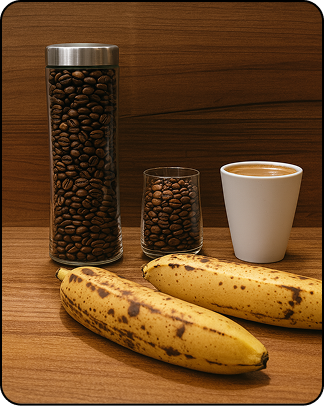

# Mitigating Cross-Image Information Leakage in Multi-Image Understanding with Large Vision-Language Models

<p>
  <a href="https://opensource.org/licenses/MIT">
    </a>
  <a href="https://arxiv.org/abs/2508.13744">
    
  </a>
</p>

<p>This repository provides the official PyTorch implementation of the following paper:</p>

<blockquote>
  <p>
    <strong>Mitigating Cross-Image Information Leakage in Multi-Image Understanding with Large Vision-Language Models</strong><br/>
    <a href="https://yejipark-m.github.io">Yeji Park</a><sup>1</sup>,
    <a href="https://sites.google.com/view/minyoung-lee">Minyoung Lee</a><sup>1</sup>,
    <a href="https://sanghyukchun.github.io/home/">Sanghyuk Chun</a><sup>2</sup><sup>*</sup>,
    <a href="https://sites.google.com/site/junsukchoe/">Junsuk Choe</a><sup>1</sup><sup>&dagger;</sup><br/>
    <sup>1</sup>Sogang University, <sup>2</sup>Princeton University<br/>
    <sup>*</sup> Works done at NAVER AI Lab.
    <sup>&dagger;</sup> Corresponding author.
  </p>
</blockquote>

## Table of Contents

- [Installation](#installation)
- [Prepare Model Checkpoints](#prepare-model-checkpoints)
- [Prepare Datasets](#prepare-datasets)
- [Evaluation](#evaluation)
- [Demo Playground](#demo-playground)
- [Analysis](#analysis)
- [License](#license)

## Installation

We provide a [Dockerfile](Dockerfile) based on Ubuntu 22.04 and CUDA 12.6.2. Install Docker with NVIDIA GPU support on the host, then follow these steps.

1. Clone the repository and enter its directory.

   ```bash
   git clone https://github.com/yejipark-m/FOCUS.git
   cd FOCUS
   ```

2. Build the Docker image.

   ```bash
   docker build -t focus:latest .
   ```

3. Start the container from the repository root.

   ```bash
   docker run -itd \
     --name focus \
     --gpus all \
     --shm-size=128G \
     --ipc=host \
     --restart=always \
     -v "$(pwd)":/root/share/FOCUS \
     -w /root/share/FOCUS \
     focus:latest /bin/bash -c "tail -f /dev/null"
   ```

   The local repository is mounted at `/root/share/FOCUS`. Adjust the container name and shared-memory setting for your machine.

4. Open the container.

   ```bash
   docker exec -it focus /bin/bash
   alias python=python3
   ```

5. Run the remaining commands inside the container from `/root/share/FOCUS`.

   ```bash
   python -m pip install ninja wheel
   python -m pip install flash-attn --no-build-isolation
   python -m pip install rouge-score
   alias python=python3
   ```


### Hugging Face cache and authentication

Model checkpoints and Hugging Face datasets are downloaded when first used. Optionally choose a cache directory:

```bash
export HF_HOME="$HOME/.cache/huggingface"
```

For resources that require authentication, authenticate with your Hugging Face account and obtain any required dataset access before running the evaluation.

## Prepare Model Checkpoints

Model names are registry keys from [configs/model_registry.py](configs/model_registry.py). The loader retrieves the corresponding Hugging Face checkpoints automatically.

| Model family | Available registry keys |
| --- | --- |
| LLaVA-OneVision | `llava-onevision-0.5b`, `llava-onevision-7b` |
| Qwen2.5-VL | `qwen2.5-vl-3b`, `qwen2.5-vl-7b` |
| Qwen3-VL | `qwen3-vl-4b`, `qwen3-vl-8b`, `qwen3-vl-30b-a3b`, `qwen3-vl-32b` |
| Qwen3-VL Thinking | `qwen3-vl-32b-thinking` |
| InternVL3 | `internvl3-2b`, `internvl3-8b` |

## Prepare Datasets

The following runners load their annotations or image datasets through Hugging Face:

| Benchmark | Dataset identifier used by the code | Runner |
| --- | --- | --- |
| Mantis-Eval | `TIGER-Lab/Mantis-Eval` | [eval/mantis.py](eval/mantis.py) |
| MuirBench | `MUIRBENCH/MUIRBENCH` | [eval/muirbench.py](eval/muirbench.py) |
| MIRB | `VLLMs/MIRB-hf` | [eval/mirb.py](eval/mirb.py) |
| Winoground | `facebook/winoground` | [eval/winoground.py](eval/winoground.py) |
| VisMin | `mair-lab/vismin-bench` | [eval/vismin.py](eval/vismin.py) |
| Vinoground | `HanSolo9682/Vinoground` | [eval/vinoground.py](eval/vinoground.py) |

### Vinoground videos

Prepare the video files locally and pass their directory with `--video_dir`. The runner expects pairs named by example index:

```text
vinoground_videos/
├── 0_pos.mp4
├── 0_neg.mp4
├── 1_pos.mp4
├── 1_neg.mp4
└── ...
```

### MMLongBench

Prepare the benchmark annotations and images in the following locations:

```text
/root/share/MMLongBench/
├── mmlb_data/
│   ├── vrag/
│   ├── NIAH/
│   ├── ICL/
│   ├── summ/
│   └── documentQA/
└── mmlb_image/
```

These paths are currently defined by `MMLB_DATA_ROOT` and `MMLB_IMAGE_ROOT` in [eval/mmlongbench.py](eval/mmlongbench.py). Update those constants if your data is elsewhere. The supplied [K8 configuration](configs/mmlongbench_K8.yaml) lists the dataset subsets and annotation files to evaluate; annotation paths are relative to `mmlb_data/`.

## Evaluation

Use module execution (`python -m ...`) from the repository root so local imports resolve correctly.

### Standard inference

```bash
python -m eval.mantis --model_name qwen2.5-vl-3b
```

### Contrastive decoding

Set `--hyperparameter` to enable the corrupted-reference and image-specific input batches:

```bash
python -m eval.mantis \
  --model_name qwen2.5-vl-3b \
  --hyperparameter 0.1 \
  --noise imagenet+uniform \
  --scale 1.0
```

The weight above is an example setting. Select it for your model and evaluation protocol.

| Argument | Description |
| --- | --- |
| `--model_name` | Model registry key. |
| `--hyperparameter` | Contrastive weight; omit it for standard inference. |
| `--noise` | Corruption mode, such as `imagenet+uniform`, `gaussian`, or `black`. |
| `--scale` | Corruption scale for the other images in each image-specific input. The reference input uses scale `1.0`. |
| `--severity` | Severity from `1` to `5` for applicable corruption modes. |
| `--seed` | Random seed; evaluation scripts default to `42`. |

### Other image benchmarks

```bash
python -m eval.muirbench --model_name qwen2.5-vl-3b
python -m eval.mirb --model_name qwen2.5-vl-3b --mode response
python -m eval.winoground --model_name qwen2.5-vl-3b
python -m eval.vismin --model_name qwen2.5-vl-3b --category object
```

Add the contrastive arguments shown above to enable contrastive decoding. VisMin accepts `object`, `attribute`, `relation`, and `counting` categories. Results are printed to the terminal.

### Video evaluation

```bash
python -m eval.vinoground \
  --model_name qwen2.5-vl-3b \
  --video_dir /path/to/vinoground_videos \
  --num_frames 8
```

### Long-context evaluation

```bash
python -m eval.mmlongbench \
  --model_name qwen2.5-vl-7b \
  --config configs/mmlongbench_K8.yaml \
  --max_samples 10
```

`--max_samples` limits each dataset subset. Omit it to evaluate all examples in the selected files. This runner also accepts the contrastive arguments above.

## Demo Playground

Inspect candidate-token logits using the bundled images:

<table>
  <tr>
    <th>First image: bottle.png</th>
    <th>Second image: banana.png</th>
  </tr>
  <tr>
    <td></td>
    <td></td>
  </tr>
</table>

Run the demo with the image order shown above:

```bash
python -m analysis.get_real_logits \
  --image1 demo/bottle.png \
  --image2 demo/banana.png \
  --model-name qwen2.5-vl-3b \
  --words beer,bottle,coffee,cup,orange \
  --prompt 'In the first image, there are yellow bananas and ______. Fill the blank with one word: beer, bottle, coffee, cup, or orange.'
```

To use your own images, replace the `--image1` and `--image2` paths and update `--prompt` and `--words`. Without explicit image paths, the script defaults to `demo/banana.png` first and `demo/bottle.png` second.

## Analysis

### Information leakage

Compare candidate probabilities with images presented individually and together:

```bash
python -m analysis.information_leakage --model_name qwen2.5-vl-3b
```

The current analysis uses VisMin examples and writes `Motivation_analysis.pdf`. Its loader also fetches Winoground, although those examples are currently excluded.

### Visual representations

```bash
python -m analysis.entangled_embedding \
  --model_name qwen2.5-vl-3b \
  --max_samples 50 \
  --num_images 4
```

This analysis loads Mantis-Eval to compare visual representations across image conditions.

### Runtime

Measure generation latency as the number of images increases:

```bash
python -m analysis.runtime_benchmark \
  --model_name qwen2.5-vl-3b \
  --image_counts 1 2 4 8 \
  --num_trials 3 \
  --output_csv runtime.csv
```

Add `--focus --hyperparameter 0.1` to measure the contrastive batch path. Runtime measurements use synthetic images and a fixed generation length, controlled by `--max_new_tokens`.

## License

This repository is distributed under the [MIT License](LICENSE.md).
